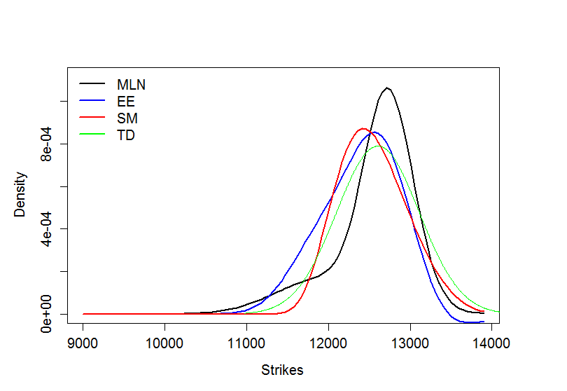
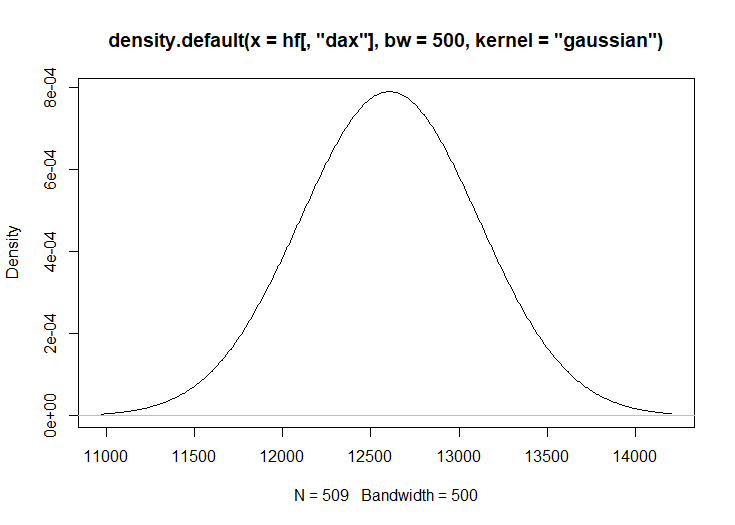
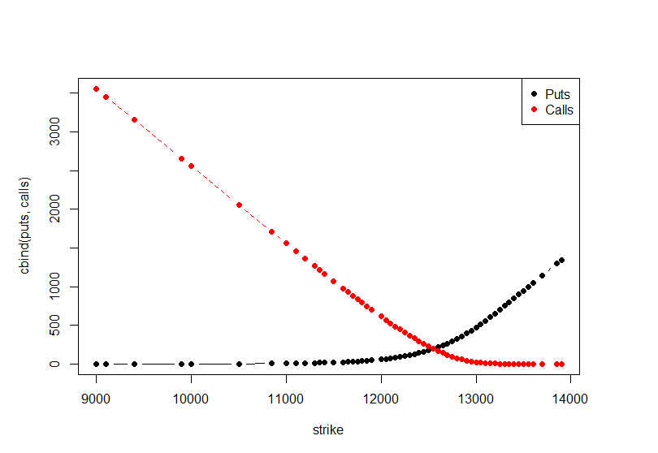

[](http://quantlet.de/)

## [](http://quantlet.de/) **RND_calibration** [](http://quantlet.de/)

```yaml

Name of Quantlet: RND_calibration

Published in: Quantlet

Description: 'Predictive accuracy analysis of option pricing models using high frequency data'

Keywords: Option pricing, RND, high frequency data

Author: Maria Culjak

```







### R Code
```r

getwd()

install.packages("writexl")
library("writexl")

install.packages("RND")
library("RND")

##set the work directory
setwd("/repository")

##reading data
dax=read.table(file="aexoptions.txt",h=T)
dim(dax)
names(dax)

##clearing raw data - expiration date and observation date set
dax.srpanj2m=subset(dax,(expiration=="21.9.2018")&(openint.c.23.03>0)&(openint.p.23.03>0)&(bid.c.23.03>0)&(bid.p.23.03>0))
dim(dax.srpanj2m)

## calls, strikes, puts
calls=(dax.srpanj2m[,"bid.c.23.03"]+dax.srpanj2m[,"ask.c.23.03"])/2
puts=(dax.srpanj2m[,"bid.p.23.03"]+dax.srpanj2m[,"ask.p.23.03"])/2
strike=dax.srpanj2m[,"strike"]


matplot(strike,cbind(puts,calls),type="b",pch=19)
legend("topright",c("Puts","Calls"),col=c("Black","Red"),pch=19)


te=182/365
s0=534.09
extract.rates(calls=calls,puts=puts,k=strike,s0=s0,te=te)

hf=read.table(file="hf219.txt",header=T)


start=proc.time()
MOE1(market.calls=calls,market.puts=puts,s0=s0,call.strikes=strike,put.strikes=strike,te=te,r=-0.00371,y=0,file.name="est",lambda=1)
end=proc.time()
end - start

MOE1<-function (market.calls, call.strikes, market.puts, put.strikes,
                call.weights = 1, put.weights = 1, lambda = 1, s0, r, te,
                y, file.name = "myfile")
{
  strikes = intersect(call.strikes, put.strikes)
  if (length(strikes) < 10)
    stop("You must have at least 10 common strikes between the calls and puts.")
  mln.obj = extract.mln.density(r = r, y = y, te = te, s0 = s0,
                                market.calls = market.calls, call.strikes = call.strikes,
                                market.puts = market.puts, put.strikes = put.strikes,
                                call.weights = call.weights, put.weights = put.weights,
                                lambda = lambda, hessian.flag = F)
  mln.alpha.1 = mln.obj$alpha.1
  mln.meanlog.1 = mln.obj$meanlog.1
  mln.meanlog.2 = mln.obj$meanlog.2
  mln.sdlog.1 = mln.obj$sdlog.1
  mln.sdlog.2 = mln.obj$sdlog.2
  ew.obj = extract.ew.density(r = r, y = y, te = te, s0 = s0,
                              market.calls = market.calls, call.strikes = call.strikes,
                              call.weights = call.weights, lambda = lambda, hessian.flag = F)
  ew.sigma = ew.obj$sigma
  ew.skew = ew.obj$skew
  ew.kurt = ew.obj$kurt
  shimko.obj = extract.shimko.density(market.calls = market.calls,
                                      call.strikes = call.strikes, r = r, y = y, te = te, s0 = s0,
                                      lower = -10, upper = +10)
  a0 = shimko.obj$implied.curve.obj$a0
  a1 = shimko.obj$implied.curve.obj$a1
  a2 = shimko.obj$implied.curve.obj$a2
  min.x = min(put.strikes, call.strikes)
  max.x = max(put.strikes, call.strikes)
  x = seq(from = min.x, to = max.x, length.out = 100)
  y.mln = dmln(x = x, alpha.1 = mln.alpha.1, meanlog.1 = mln.meanlog.1,
               meanlog.2 = mln.meanlog.2, sdlog.1 = mln.sdlog.1, sdlog.2 = mln.sdlog.2)
  y.ew = dew(x = x, r = r, y = y, te = te, s0 = s0, sigma = ew.sigma,
             skew = ew.skew, kurt = ew.kurt)
  y.shimko = dshimko(r = r, te = te, s0 = s0, k = x, y = y,
                     a0 = a0, a1 = a1, a2 = a2)
  max.y = max(y.mln, y.ew, y.shimko) * 1.05
  if (!is.numeric(max.y))
    max.y = 1
  cut.off = (min(x) + max(x))/2
  max.ind = which.max(y.mln)
  if (x[max.ind] > cut.off)
    legend.location = "topleft"
  else legend.location = "topright"
  par(mar = c(5, 5, 5, 5))
  matplot(x, cbind(y.mln, y.ew, y.shimko), type = "l",
          col = c("black", "blue", "red"), xlab = "Strikes",
          ylab = "Density", lwd = c(2, 2, 2), lty = c(1,
                                                      1, 1), cex.axis = 1.25, cex.lab = 1.25, ylim = c(0,
                                                                                                       max.y))
  legend(legend.location, legend = c("MLN", "EE", "SM", "TD"), col = c("black", "blue",
                                                                 "red", "green"), lwd = c(2, 2, 2,2), lty = c(1,
                                                                                                   1, 1,1), bty = "n", cex = 1.25)

  lines(density(hf[,"aex"], bw=20,  kernel = "gaussian"), col ="green")
  mln.predicted.puts = price.mln.option(r = r, te = te, y = y,
                                        k = put.strikes, alpha.1 = mln.alpha.1, meanlog.1 = mln.meanlog.1,
                                        meanlog.2 = mln.meanlog.2, sdlog.1 = mln.sdlog.1, sdlog.2 = mln.sdlog.2)$put
  mln.predicted.calls = price.mln.option(r = r, te = te, y = y,
                                         k = call.strikes, alpha.1 = mln.alpha.1, meanlog.1 = mln.meanlog.1,
                                         meanlog.2 = mln.meanlog.2, sdlog.1 = mln.sdlog.1, sdlog.2 = mln.sdlog.2)$call
  ew.predicted.puts = price.ew.option(r = r, te = te, s0 = s0,
                                      k = put.strikes, y = y, sigma = ew.sigma, skew = ew.skew,
                                      kurt = ew.kurt)$put
  ew.predicted.calls = price.ew.option(r = r, te = te, s0 = s0,
                                       k = call.strikes, y = y, sigma = ew.sigma, skew = ew.skew,
                                       kurt = ew.kurt)$call
  shimko.predicted.puts = numeric(length(put.strikes))
  for (i in 1:length(put.strikes)) {
    shimko.predicted.puts[i] = price.shimko.option(r = r,
                                                   te = te, s0 = s0, k = put.strikes[i], y = y, a0 = a0,
                                                   a1 = a1, a2 = a2)$put
  }
  shimko.predicted.calls = numeric(length(put.strikes))
  for (j in 1:length(put.strikes)) {
    shimko.predicted.calls[j] = price.shimko.option(r = r,
                                                    te = te, s0 = s0, k = call.strikes[j], y = y, a0 = a0,
                                                    a1 = a1, a2 = a2)$call
  }
  tmp.data.calls = cbind(market.calls, call.strikes, mln.predicted.calls, ew.predicted.calls,
                         shimko.predicted.calls)
  tmp.data.puts = cbind(market.puts, put.strikes, mln.predicted.puts, ew.predicted.puts,
                        shimko.predicted.puts)
  tmp.data=rbind(tmp.data.calls,tmp.data.puts)
  colnames(tmp.data) = c("market", "strikes", "mln", "ew", "shimko")
  data.calls = as.data.frame(tmp.data)
  #write_xlsx(data.calls, file = paste(file.name, "est.xlsx",
  #                                    sep = ""), sheetName="estimatedprices", append=FALSE)
  tmp.parameters=rbind(mln.alpha.1, mln.meanlog.1, mln.meanlog.2, mln.sdlog.1, mln.sdlog.2, ew.sigma, ew.skew, ew.kurt, a0, a1, a2)
  tmp.parameters=as.data.frame(tmp.parameters)
  #write_xlsx(tmp.parameters, file = paste(file.name, "est.xlsx",
  #                                        sep = ""), sheetName="parameters", append=TRUE)
  tmp.densit=cbind(x,y.mln, y.ew, y.shimko)
  tmp.densit=as.data.frame(tmp.densit)
  #write_xlsx(tmp.densit, file = paste(file.name, "est.xlsx",
  #                                    sep = ""), sheetName="densities", append=TRUE)
  write_xlsx(list(data.calls = data.calls, tmp.parameters = tmp.parameters, tmp.densit = tmp.densit), "est.xlsx")
  out = list(mln.alpha.1 = mln.alpha.1,
             mln.meanlog.1 = mln.meanlog.1, mln.meanlog.2 = mln.meanlog.2,
             mln.sdlog.1 = mln.sdlog.1, mln.sdlog.2 = mln.sdlog.2,
             ew.sigma = ew.sigma, ew.skew = ew.skew, ew.kurt = ew.kurt,
             a0 = a0, a1 = a1, a2 = a2)
  out
}

##kernel density calibration
setwd("/repository")
hf=read.table(file="hf178.txt",header=T)
plot(density(hf[,"mib"],  kernel = "gaussian", bw=700))
warnings()


```

automatically created on 2020-01-29